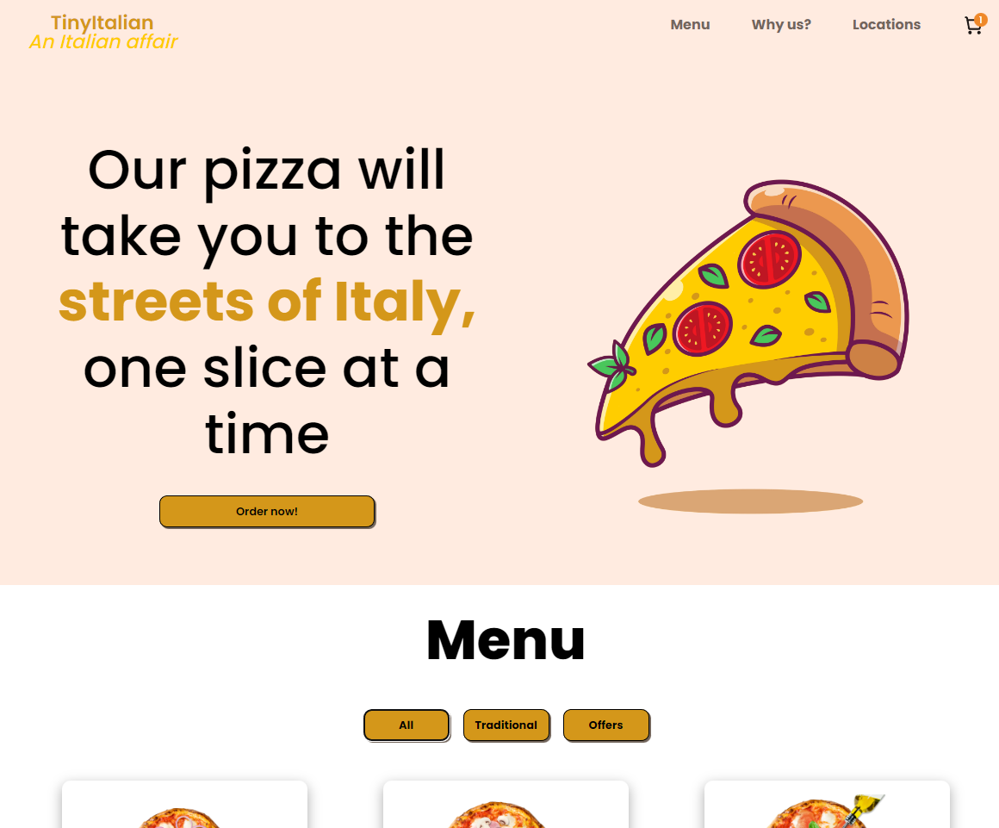

# Tiny Italian, restaurante de pizza italiano
_[Read it in English](#English)_

O TinyItalian é um restaurante fictício de pedidos e entregas de pizza. Foi desenvolvido como desafio de projeto solo do módulo 5 do [Scrimba](scrimba.com). A príncipio o desafio era apenas criar um pequeno menu de pedidos de um restaurante seguindo um design do figma mas resolvi criar uma página web completa com 'Sobre nós', 'Localidades' e um menu completo com formulário de pagamento e mensagem de agradecimento. Inspiração pro design: [Yooshi Japanese Cuisine](https://www.leodeleon.co/yooshi/).

## Índice

- [Geral](#geral)
  - [Funções implementadas](#funções-implementadas)
  - [Screenshot](#screenshot)
  - [Links](#links)
- [Meu processo](#meu-processo)
  - [Tecnologias Utilizadas](#tecnologias-utilizadas)
  - [O que eu aprendi](#o-que-eu-aprendi)
- [Feito por](#feito-por)

## Geral

### Funções implementadas

Os usuários devem ser capazes de:

- Adicionar ou remover um pedido para o carrinho
- Clicar em qualquer carrinho na página e ir para o carrinho de pedidos
- Preencher o formulário corretamente e ver o seu nome na mensagem de agradecimento
- Abrir a 'nav-bar' enquanto estiver em mobile e navegar pela página
- Navegar pelos filtros do menu e ver o cardápio de acordo 

### Screenshot



### Links

- [Live version](https://tiny-italian.vercel.app)

## Meu processo

### Tecnologias Utilizadas

- Semantic HTML5 markup
- CSS custom properties
- Grid
- Flexbox
- Mobile first workflow
- JavaScript
- Acessibilidade


### O que eu aprendi

- forEach() para iterar sobre 'menuArray' array data
- DataAttributes para armazenar uuid de itens do menu e para dar toggle em visibilidade de componentes 
- Como validar um formilário usando if, else e boolean
- splice method para apagar itens do carrinho
- @keyframes no css para criar animações personalizadas
- Acessibilidade utilizando 'aria-controls, aria-hidden, aria-expanded e .visually-hidden utility class


```html
  <h1>Some HTML I am proud of</h1>
  
             <div class="nav-wrapper">
                <a href="#" class="logo-link">
                    <span class="logo fw-semi-bold text-accent">TinyItalian</span>
                    <span class="logo-slogan fw-medium text-secondary-accent">An Italian affair</span>
                </a>
                <button class="mobile-nav-toggle" id="mobile-nav-toggle" aria-controls="primary-navigation" aria-expanded="false">
                    
                    <span class="visually-hidden">Menu</span>
                </button>
                <nav class="primary-navigation" id="primary-navigation">
                    <ul role="list" aria-label="Primary" class="nav-list">
                        <li>
                            <a href="#" id="nav-menu">Menu</a>
                        </li>
                        <li>
                            <a href="#" id="nav-whyus">Why us?</a>
                        </li>
                        <li>
                            <a href="#" id="nav-locations">Locations</a>
                        </li>
                        <li id="nav-shopping-cart" class="nav-shopping-cart">
                            
                        </li>
                    </ul>
                </nav>
            </div>
```
```css
  .proud-of-this-css {

@keyframes fadeInMobileNav {
    0% {
      opacity: 0;
      transform: translateX(-20px);
    }
    100% {
      opacity: 1;
      transform: translateX(20px);
    }
}

@keyframes fadeInBaskets {
    0% {
        opacity: 0;
      }
      100% {
        opacity: 1;
      }
}

@keyframes fadeInMenuItems {
    0% {
        opacity: 0;
        transform: translateY(-40px);
      }
      100% {
        opacity: 1;
        transform: translateY(0px);
      }
}

```
```js
const proudOfThisFunc = () => {
  
  function handleDecrementOrderBtnClick(id){
    const targetItemObj = menuArray.filter( (item) => {
        return item.uuid === id
    })[0]

    targetItemObj.itemCount--

    document.querySelector(`[data-item-count="${id}"]`).textContent = targetItemObj.itemCount
    
    if(targetItemObj.itemCount < 1){
        document.querySelector(`[data-order-button-div="${id}"]`).innerHTML = 
        `
        <button class="card-order-btn fs-300 fw-semi-bold" data-order-button="${id}">
            Order
        </button>
        `

        basketItemsArray.forEach( (item, index) => {
            if(targetItemObj === item){
                basketItemsArray.splice(index, 1)
            }
        })

    }
}
```


## Feito por

<div>
  <a href="https://www.linkedin.com/in/ffernando-costa/?locale=en_US" target="_blank"></a>
  <a href="https://twitter.com/ffernandodev" target="_blank">
</div>


<div id="English">

_English version_

</div>

# TinyItalian

This is a project I built after module 5 of [Scrimba's](scrimba.com) JavaScript course as a solo project challenge. I was supposed to follow a figma design to code a simple menu for a restaurant with three items on it. I changed my mind and decided to code a full web page with a nav menu, menu with items and filter buttons, why us section, locations, footer, payment form and thank you message for a fictitious italian pizza restaurant. Design inspiration: [Yooshi Japanese Cuisine](https://www.leodeleon.co/yooshi/).
## Table of contents

- [Overview](#overview)
  - [The challenge](#the-challenge)
  - [Screenshot](#screenshot)
  - [Links](#links)
- [My process](#my-process)
  - [Built with](#built-with)
  - [What I learned](#what-i-learned)
- [Author](#author)

## Overview

### The challenge

Users should be able to:

- Add or remove an items from basket
- Click on every little basket and go to the basket to see items
- Fill out the form correctly and place the order to see the thank you message with their name on it
- Open mobile nav bar while on mobile
- Click on each filter button to see the filtered menu items

### Screenshot


### Links

- [Live version](https://tiny-italian.vercel.app)

## My process

### Built with

- Semantic HTML5 markup
- CSS custom properties
- Grid
- Flexbox
- Mobile first workflow
- JavaScript
- Accessibility


### What I learned

- forEach() to iterate over 'menuArray' data array
- DataAttributes to store uuid on menu items and to toggle components visibility
- How to validate a form using if, else and boolean statements
- splice() method to remove an specific item from the basket
- @keyframes on css to create personalized animations
- Accessibility using 'aria-controls, aria-hidden, aria-expanded and .visually-hidden utility class


```html
  <h1>Some HTML I am proud of</h1>
  
             <div class="tweet-reply">
                <div class="tweet-inner">
                    
                    <div>
                        <p class="handle">${reply.handle}</p>
                        <p class="tweet-text">${reply.tweetText}</p>
                        <div class="tweet-details">
                            <span class="tweet-detail">
                                <i class="fa-solid fa-heart ${replyLikeIconclass}"
                                    data-reply-like="${reply.uuid}"
                                    id="reply-like-${reply.uuid}"
                                    ></i>
                                <span id="reply-likes-count-${reply.uuid}">
                                    ${reply.likes}
                                </span>
                            </span>
                            <span class="tweet-detail">
                                <i class="fa-solid fa-retweet ${replyRetweetIconClass}"
                                data-reply-retweet="${reply.uuid}"
                                id="reply-retweet-${reply.uuid}"
                                ></i>
                                <span id="reply-retweets-count-${reply.uuid}">
                                    ${reply.retweets}
                                </span>
                            </span>
                            <span class="tweet-detail">
                                <i class="fa-regular fa-trash-can"
                                    data-delete-reply-tweet="${reply.uuid}"
                                ></i>
                            </span>
                        </div>
                    </div>
                </div>
            </div>
```
```css
  .proud-of-this-css {

.tweet-input-area {
    display: flex;
    align-items: flex-start;
    gap: 10px;
}

.tweet-reply-area {
    display: grid;
    gap: 8px;
    grid-template-columns: auto 1fr;
    grid-template-areas: 
    "profile-pic tweet-reply-input"
    "profile-pic tweet-reply-btn"
}

```
```js
const proudOfThisFunc = () => {
  
  function handleDeleteTweetBtnClick(tweetId){
    const targetTweetObj = tweetsData.filter(function(tweet){
        return tweet.uuid === tweetId
    })[0]

    tweetsData.forEach(function(tweet, index){
        
        if(targetTweetObj === tweet){
            tweetsData.splice(index, 1)
        }

    })

    render()
}

function handleDeleteReplyTweetBtnClick(replyId) {
    let targetReplyObj = null;
    
    tweetsData.forEach(function(tweet) {
        const replyIndex = tweet.replies.findIndex((reply) => reply.uuid === replyId);
      
        if (replyIndex !== -1) {
            targetReplyObj = tweet.replies[replyIndex];
            tweet.replies.splice(replyIndex, 1);
        }
    })

    render()
}
```


## Author

<div>
  <a href="https://www.linkedin.com/in/ffernando-costa/?locale=en_US" target="_blank"></a>
  <a href="https://twitter.com/ffernandodev" target="_blank">
</div>
